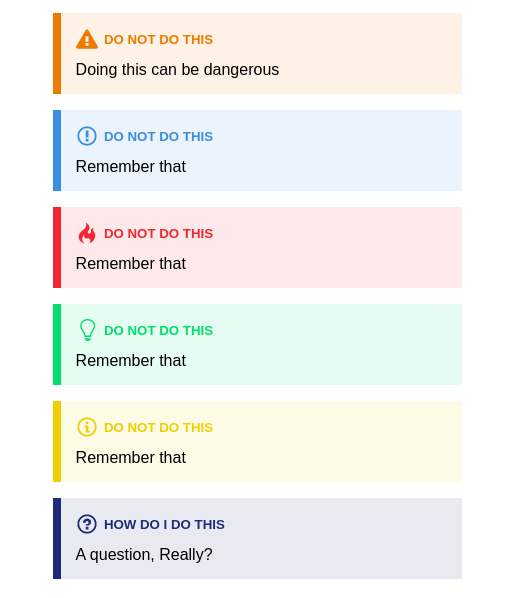

# react-admonitions

> An admonitions React component, ported from remarkable-admonitions. Perfect for Docusaurus v2 and other React-based doc generators.

[](https://www.npmjs.com/package/react-admonitions) [](https://standardjs.com) [](https://travis-ci.com/nebrelbug/react-admonitions)

Test the component out [on Stackblitz](https://stackblitz.com/edit/react-admonitions), or view the [demo](https://nebrelbug.github.io/react-admonitions/)

## Install

```bash
npm install --save react-admonitions
```

## Screenshots



## Usage

```jsx
import React, { Component } from 'react'

import Admonition from 'react-admonitions'

class Example extends Component {
  render() {
    return (
      <Admonition type="warning" title="Do not do this">
        Admonition Content
      </Admonition>
    )
  }
}
```

## Props

| Name           | Default | Description                                                                                                            |
| -------------- | ------- | ---------------------------------------------------------------------------------------------------------------------- |
| **`type`**     | none    | What type of admonition you want to display. Valid options: `"warning"`, `"tip"`, `"caution"`, `"note"`, `"important"` |
| **`iconType`** | `"svg"` | The type of admonition icon. Valid options: `"svg"`, `"emoji"` |
| **`title`** | none | The, well, title of the admonition |

## Credits

HTML, styles, and concept all come from the amazing Markdown plugin by [@favoloso](https://github.com/favoloso), [remarkable-admonitions](https://github.com/favoloso/remarkable-admonitions).

## License

MIT © [nebrelbug](https://github.com/nebrelbug)
